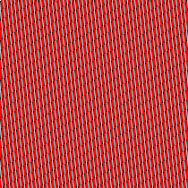
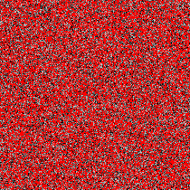
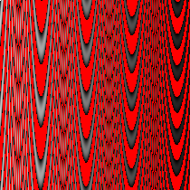
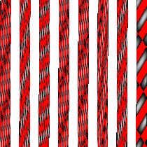
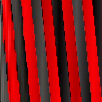

# Drawdio
Creates different styles of drawings from source audio

# What it does
Reads the PCM of a wav audio file, then draws an image where the width and height is the square root of the number of samples, and each pixel is a gradient from either red to black for a negative Pulse, black for a null pulse (0), or gradient black to white for a positive pulse.

# Usage Example
### Input
`go run main.go pixelate -f data/tone-1000hz.wav`

### Output
`tone-1000hz-SECOND_OF_GENERATION.png`

# Output Examples

